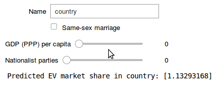

# Electric mobility study

## Summary

This is a study of the electric vehicle market in Europe. The objective is to better understand the market and hypothesize which factors influence EV adoption rates. 

I chose a set of characteristics that I suspected correlate with EV market share. These characteristics were:
* Same-sex marriage: allowed or not?
* Gini index (the higher, the greater the income inequality)
* Share of votes of nationalist parties in parliament
* Social progress index
* GDP per capita (PPP)

I created a predictive model that uses these characteristics as input and predicts the market share of EVs.

After evaluating multiple models, I settled on a linear regression model that takes into account a subset of these characteristics:

**[The resulting model can be viewed here (interactive)](https://hub.gke.mybinder.org/user/maxims94-electric-mobility-study-aoqgtg6m/notebooks/notebooks/dataset2-interactive.ipynb)**

**Some of the most striking results:**
* Norway is unparalleled in the world when it comes to EV market share. In fact, its numbers were so high that I had to exclude it from the training data.
* The time series data on electric car registrations in Europe shows an exponential trend in EV adoption; this is likely to continue in the next years and we should expect the share of EVs to rise immensely
* Nearly every European country sees a steady rise in the market share of EVs: some (Poland, Hungary) more slower than others (Germany, France), but the trend is unmistakable!
* To my surprise, success of nationalist parties does not correlate negatively with EV market share! The other characteristics, however, behave as expected (the strongest correlation is with GDP per capita)

## Notebooks

### Dataset 1 (Data from Eurostat)

* [Dataset 1: Cleaning](https://nbviewer.jupyter.org/github/maxims94/electric-mobility-study/blob/master/notebooks/dataset1-cleaning.ipynb)
* [Dataset 1: EV market share](https://nbviewer.jupyter.org/github/maxims94/electric-mobility-study/blob/master/notebooks/dataset1-1-market-share.ipynb)
* [Dataset 1: Exploration](https://nbviewer.jupyter.org/github/maxims94/electric-mobility-study/blob/master/notebooks/dataset1-exploration.ipynb)

### Dataset 2 (Full data set, model training)

* [Dataset 2: Creation](https://nbviewer.jupyter.org/github/maxims94/electric-mobility-study/blob/master/notebooks/dataset2-creation.ipynb)
* [Dataset 2: Exploration](https://nbviewer.jupyter.org/github/maxims94/electric-mobility-study/blob/master/notebooks/dataset2-exploration.ipynb)
* [Dataset 2: Model](https://nbviewer.jupyter.org/github/maxims94/electric-mobility-study/blob/master/notebooks/dataset2-model.ipynb)
* Dataset 2: Interactive ([binder](https://hub.gke.mybinder.org/user/maxims94-electric-mobility-study-aoqgtg6m/notebooks/notebooks/dataset2-interactive.ipynb), [nbviewer](https://nbviewer.jupyter.org/github/maxims94/electric-mobility-study/blob/master/notebooks/dataset2-interactive.ipynb))

## Data

* [Original data (Eurostat)](https://github.com/maxims94/electric-mobility-study/blob/master/data/road_eqr_carpda_1_Data.csv)
* [Dataset 1 (cleaned)](https://github.com/maxims94/electric-mobility-study/blob/master/data/road_eqr_carpda_cleaned.csv)
* [Dataset 2 (cleaned, data for model training)](https://github.com/maxims94/electric-mobility-study/blob/master/data/dataset2.csv)
